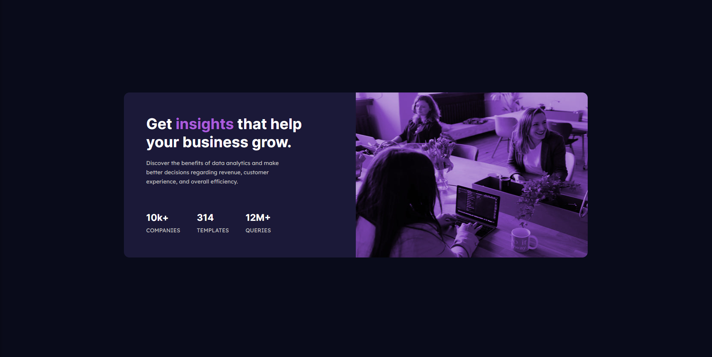
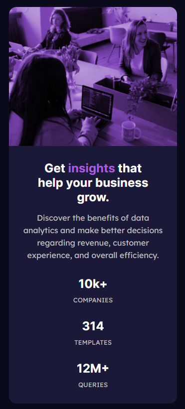

# Frontend Mentor - Stats preview card component solution

This is a solution to the [Stats preview card component challenge on Frontend Mentor](https://www.frontendmentor.io/challenges/stats-preview-card-component-8JqbgoU62). Frontend Mentor challenges help you improve your coding skills by building realistic projects. 

## Table of contents

- [Overview](#overview)
  - [The challenge](#the-challenge)
  - [Screenshot](#screenshot)
  - [Links](#links)
- [My process](#my-process)
  - [Built with](#built-with)
  - [What I learned](#what-i-learned)
  - [Continued development](#continued-development)
  - [Useful resources](#useful-resources)
- [Author](#author)
- [Acknowledgments](#acknowledgments)

## Overview

### The challenge

Users should be able to:

- View the optimal layout depending on their device's screen size

### Screenshot

### Links

- Solution URL: [Solution](https://www.youtube.com/watch?v=hHbWF1Bvgf4)
- Live Site URL: [Live site](https://sklady.netlify.app)

## My process

I started with HTML first, then added all the styling with CSS.

I'm certain that there's a better way of doing things (code wise), however this is the best I can do right now.

I made sure that the website would be **responsive** and not *static*, meaning the website will change based on the width of the user's device, that's being used to view the website.

I tried to color the [stock_image](./images/image-header-desktop.jpg) with CSS, after multiple tries using different methods, to no avail, even though I got different results every time, I wasn't satisfied with any of them. So, as a ~~cheat~~ *workaround*, I decided to throw the [stock_image](./images/image-header-desktop.jpg) to GIMP and use the *colorize* function to get the [modified_image](./images/image-header-desktop_GIMP.jpg), I was satisfied with.

### Built with

- Semantic HTML5 markup (Just a little)
- CSS custom properties
- Flexbox
- Mobile-first workflow

### What I learned

I learned the importance of having a *game plan*, when tackling a project like this.

Also, while working on this project, I've found out about the ***Mobile-first workflow***, which was very helpful in getting the end-result I desired, which was to make a *responsive* website.

Ultimately, I learned the difference between a *static* and *responsive* web-design. I've successfully created a **very, very** simple Stats preview card component. And I've also been able to make my very first responsive web-design (The web page changes, based on the width of the device - phone/pc).

### Continued development

Like, literally everything. xD

### Useful resources

- [Video](https://www.youtube.com/watch?v=ZYV6dYtz4HA&list=WL&index=1&t=0s) - This is in my opinion a great video for beginners, that want to learn the basics of responsive web design.

## Author

- Frontend Mentor - [@Hikki666](https://www.frontendmentor.io/profile/Hikki666)
- E-mail - jan.skladany1234@seznam.cz

## Acknowledgments

The [Video](https://www.youtube.com/watch?v=ZYV6dYtz4HA&list=WL&index=1&t=0s), that was already mentioned ,was a great help. Definitely encourage you to check it out.
